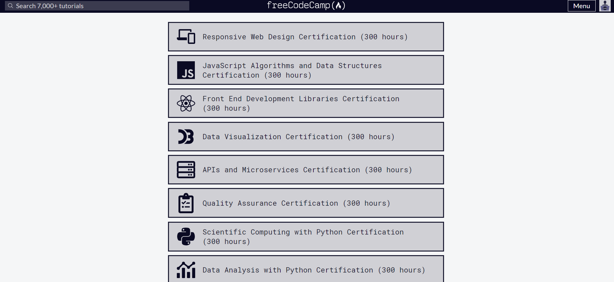

## FreeCodeCamp - Course Structure

<ol>
  <li>Responsive Web Design</li>
  <li>JS Algorithms and Data Structures</li>
  <li>Front End Libraries</li>
  <li>Data Visualization</li>
  <li>APIs and Microservices</li>
</ol>
</img>
